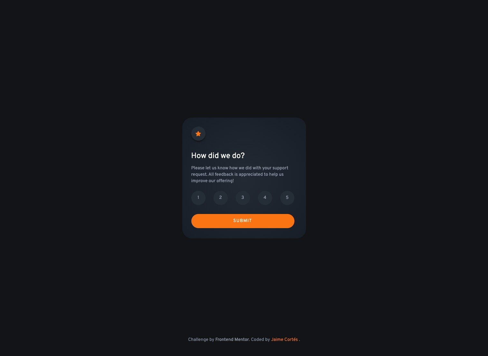
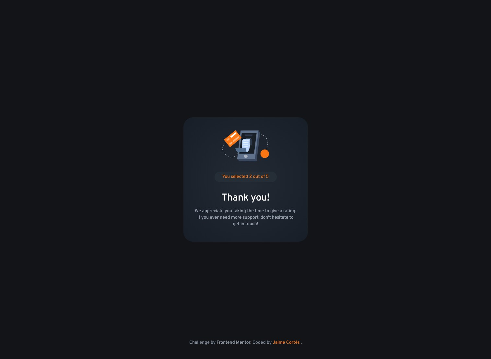

# Frontend Mentor - Interactive rating component solution

This is a solution to the [Interactive rating component challenge on Frontend Mentor](https://www.frontendmentor.io/challenges/interactive-rating-component-koxpeBUmI). Frontend Mentor challenges help you improve your coding skills by building realistic projects.

## Table of contents

- [Overview](#overview)
  - [The challenge](#the-challenge)
  - [Screenshot](#screenshot)
  - [Links](#links)
- [My process](#my-process)
  - [Built with](#built-with)
  - [What I learned](#what-i-learned)
  - [Continued development](#continued-development)
- [Author](#author)

## Overview

### The challenge

Users should be able to:

- View the optimal layout for the app depending on their device's screen size
- See hover states for all interactive elements on the page
- Select and submit a number rating
- See the "Thank you" card state after submitting a rating

### Screenshots




### Links

- Solution URL: [live site URL](https://dashing-zuccutto-3476b2.netlify.app/)

## My process

### Built with

- Mobile-first workflow
- [React](https://reactjs.org/) - JS library
- [TailwindCSS](https://tailwindcss.com/) - CSS framework

### What I learned

I use primarily TailwindCSS and React. Basically I made the decision to handle the logic whit two variables, one that changes the value dinamically when the user clicks the different rating buttons, and other that gets the rate set by the user.

```js
const [value, setValue] = useState(0);
const [rating, setRating] = useState(0);
```

I don't try to make the code as eficient as posible, instead I try to mix things that I learn along the way so I get more practice.

### Continued development

I think the app can be improved by handling the case where the user clicks on the backgraound after clicking a rating button, so the grey hover effect on the button goes away so this can lead to confusion.

## Author

- Frontend Mentor - [@Jaumet91](https://www.frontendmentor.io/profile/Jaumet91)
- Twitter - [@Jaumet_GG](https://twitter.com/Jaumet_GG)
